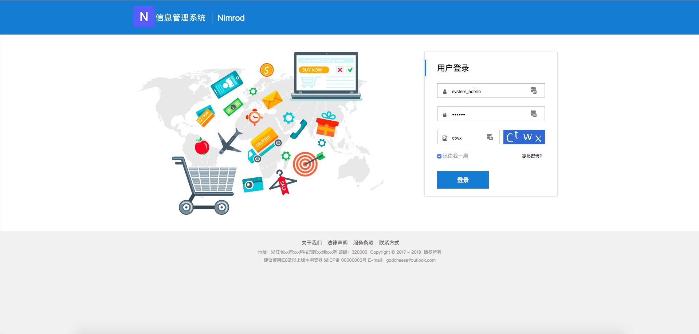
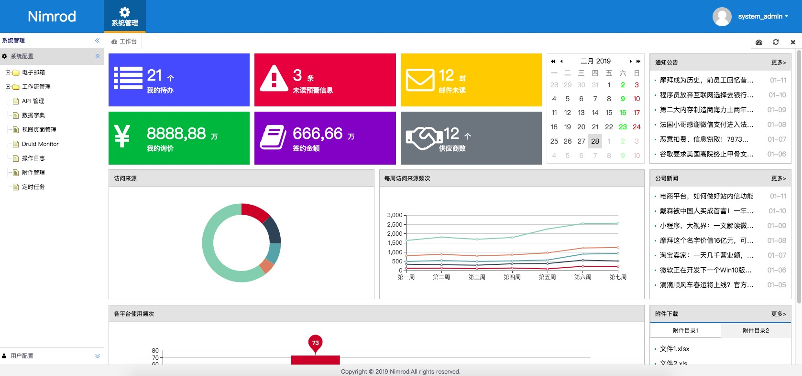
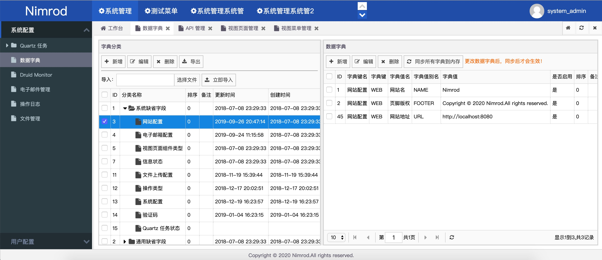

<p align="center">
  
</p>
<p align="center">
  <a href="https://github.com/godcheese/nimrod">
    
  </a>
  <a href="https://github.com/godcheese/nimrod/releases">
    
  </a>
  <a href="https://travis-ci.org/godcheese/nimrod" rel="nofollow">
    
  </a>
  <a href="https://github.com/godcheese/nirmod/blob/master/LICENSE">
    
  </a>
<!--   <a href="https://gitter.im/repo-name/discuss">
    
  </a> -->
<!--   <a href="https://godcheese.github.io/nimrod/donate">
    
  </a> -->
</p>

## 简介 Introduction

Nimrod 是一款基于 Spring Boot 封装的 Java Web 平台快速开发脚手架，所采用的技术栈包括 Spring Boot、Spring、Spring MVC、MyBatis、Thymeleaf等，遵守[阿里巴巴 Java 开发规约](https://github.com/alibaba/p3c)，帮助养成良好的编码习惯。整体采用 RBAC （ Role-Based Access Control ，基于角色的访问控制），具有严格的权限控制模块，支持系统与模块分离开发。最后希望这个项目能够对你有所帮助。

- Nimrod 开发交流群：547252502（QQ 群）
- [Preview](http://)
- [Documentation](https://)
- [Donate](https://)
- [Gitee](https://gitee.com/godcheese/nimrod)


|环境  |版本|
|:-----|---|
|[Java](https://www.oracle.com/technetwork/java/javase/downloads/jdk8-downloads-2133151.html)  |1.8|
|[MySQL](https://dev.mysql.com/downloads/mysql/5.7.html#downloads) |5.7|
|[Maven](http://maven.apache.org/download.cgi) |3.5|
|[Tomcat](https://tomcat.apache.org/download-80.cgi)|8.5|

|依赖            |版本         |
|:------------- |:------------|
|[Spring Boot](http://mvnrepository.com/artifact/org.springframework.boot/spring-boot)    |2.1.1.RELEASE|
|[Spring Web MVC](http://mvnrepository.com/artifact/org.springframework/spring-webmvc)     |5.1.3.RELEASE|
|[Spring Security Web](http://mvnrepository.com/artifact/org.springframework.security/spring-security-web)|5.1.2.RELEASE|
|[MyBatis](http://mvnrepository.com/artifact/org.mybatis/mybatis)        |3.4.6      |
|[Thymeleaf](http://mvnrepository.com/artifact/org.thymeleaf/thymeleaf)      |3.0.11.RELEASE|
|[Druid](http://mvnrepository.com/artifact/com.alibaba/druid-spring-boot-starter)          |1.1.10       |

|测试账号     |        |                                       |
|:-----------|:-------|:--------------------------------------|
|Username    |Password|Role & Authority                       |
|system_admin|123456  |ROLE_USER,ROLE_ADMIN,ROLE_SYSTEM_ADMIN |
|admin       |123456  |ROLE_USER,ROLE_ADMIN,/API/SYSTEM/INDEX |
|user        |123456  |ROLE_USER                              |

## [环境搭建](https://github.com/godcheese/nimrod/wiki/%E7%8E%AF%E5%A2%83%E6%90%AD%E5%BB%BA)

## 特性 Features

- 数据字典 ✓
- 角色管理 ✓
- 用户管理 ✓
  - 在线用户 ✗
- 权限管理 ✓
  - 视图菜单 ✓
  - 视图页面 ✓
  - 视图页面组件 ✓
  - API ✓
- 电子邮件管理（ActiveMQ） ✓
- 请求日志 ✓
- 附件管理 ✓
- 定时任务 ✗
- 部门管理 ✓
- 工作流 ✗

## 开始 Getting started

```bash
# clone the project
git clone https://github.com/godcheese/nimrod.git

# package
mvn clean package

# develop
mvn spring-boot:run
```

This will open http://localhost:8080/nimrod.

Refer to [Documentation](https://godcheese.github.io/nirmod/guide/essentials/deploy.html) for more information

## 更新日志 Changelog

Detailed changes for each release are documented in the [release notes](https://github.com/godcheese/nimrod/releases).

## 在线演示 Online Demo

[Preview](https://github.com/godcheese/nimrod)

#### Screenshots




## 捐赠 Donation

If you find Nimrod useful, you can buy us a cup of coffee

[Paypal Me](https://www.paypal.me/godcheese)

## 浏览器支持 Browsers support

Modern browsers and Internet Explorer 8+.

| [](http://godban.github.io/browsers-support-badges/)</br>IE / Edge | [](http://godban.github.io/browsers-support-badges/)</br>Firefox | [](http://godban.github.io/browsers-support-badges/)</br>Chrome | [](http://godban.github.io/browsers-support-badges/)</br>Safari |
| --------- | --------- | --------- | --------- |
| IE8, IE9, IE10, IE11, Edge| last 15 versions| last 15 versions| last 10 versions
